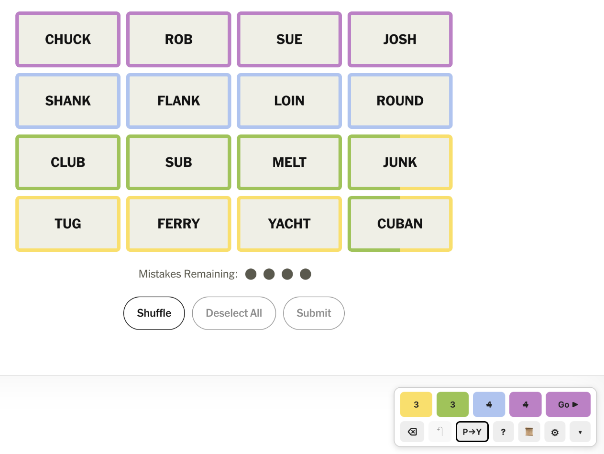
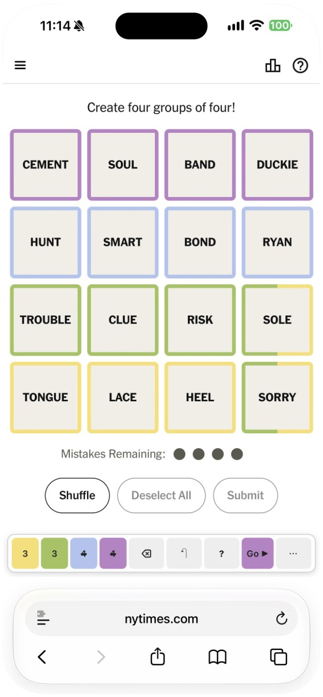
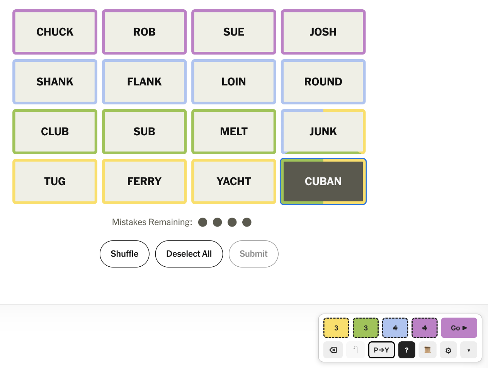
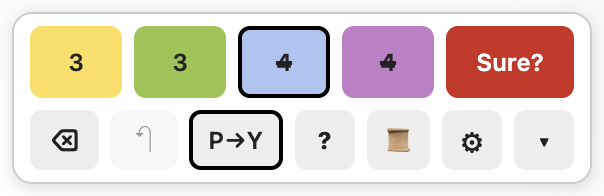
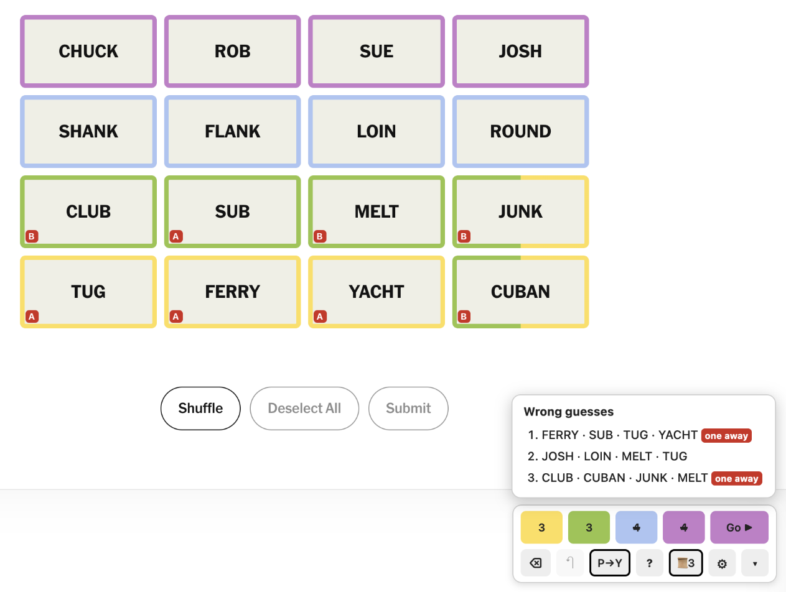
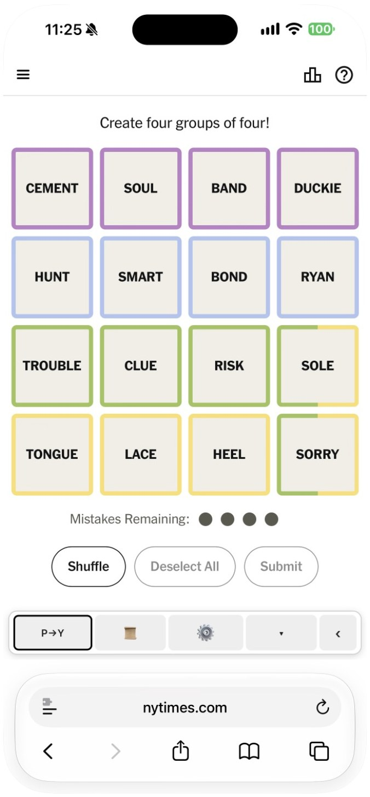
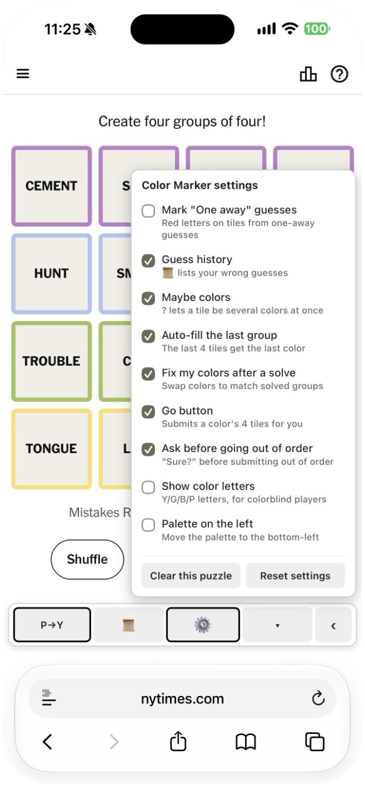
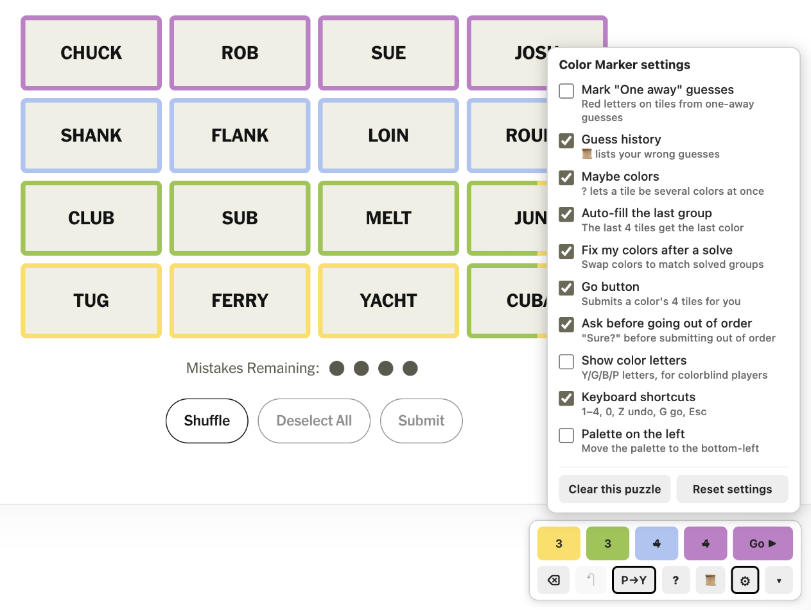
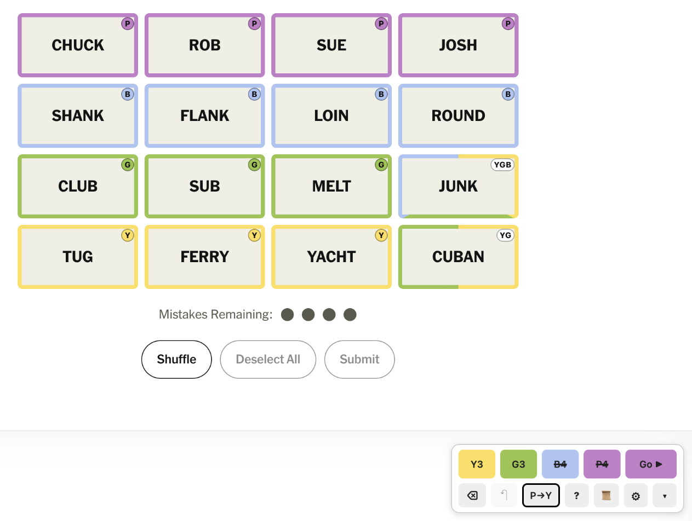

# Connections Color Marker

Color-code the tiles in NYT Connections as you work out the groups, then submit them in whatever order you like. It's especially handy if you go for a **reverse rainbow**: solving the hardest group (purple) first and the easiest (yellow) last.

**Install:** [Greasy Fork](https://greasyfork.org/en/scripts/599362-connections-color-marker) · [GitHub](https://raw.githubusercontent.com/dividedby/games-scripts/main/connections/connections-color-marker.user.js) · [Changelog](../CHANGELOG.md#connections-color-marker)

<p align="center">
  
  &nbsp;
  
</p>

## Quick start

1. Install the script from [Greasy Fork](https://greasyfork.org/en/scripts/599362-connections-color-marker) or [GitHub](https://raw.githubusercontent.com/dividedby/games-scripts/main/connections/connections-color-marker.user.js) (see [Installing](../README.md#installing)) and open a Connections puzzle. A color palette appears in the bottom-right corner once the board is showing.
2. Select tiles the way you normally would, then tap a color on the palette. The tiles get an outline in that color and are deselected, ready for the next group.
3. Once a color has 4 tiles, tap **Go ▶** to submit them. Go works through the colors in your sort order: purple, blue, green, then yellow, unless you change it.

## Marking

- Each color holds up to 4 tiles. The number on each color button shows how many it has.
- ⌫ clears the selected tiles, and ↶ undoes your last change.
- Color already full? Select one of its tiles plus the tile you want to add, then tap the color. The two tiles swap colors.
- Changed your mind about two whole groups? With nothing selected, tap both colors and they swap everywhere.
- Once three colors have 4 tiles each, the remaining 4 tiles get the last color automatically.

## Sorting

As soon as you color a tile, it moves into a row with the other tiles of that color, so each group sits in its own row. The button labeled **P→Y** sets the order of the rows:

| Button | Row order | What Go submits first |
| --- | --- | --- |
| **P→Y** (default) | Purple, blue, green, yellow: the reverse rainbow | Purple |
| **Y→P** | Yellow, green, blue, purple: the rainbow | Yellow |
| **Off** | Tiles stay wherever the game puts them | Purple |

Tap the button to switch between them. The game's Shuffle button still works, but it won't break up your rows. On a phone, the sort button is behind **⋯**.

## Maybe colors (optional)

For tiles you're unsure about. Turn this on in ⚙, and a **?** button appears on the palette. Tap **?**, select a tile and tap two colors, say yellow and green: the tile's outline splits between them, half and half (or in thirds for three colors). Tap a color again to take it back out. Once only one color is left, the tile is an ordinary colored tile again. Tap **?** again to go back to normal coloring.

- Split tiles don't count toward Go, auto-fill or the 4-per-color limit.
- When a color is solved it drops out of every split, so a yellow-or-green tile becomes green once yellow is solved.
- While **?** is on, tiles stay put so they don't jump around as you add colors. When you turn **?** off, they move into place: below your color rows, with the same combinations grouped together (all the green-or-blue tiles side by side, for example).
- A **dashed** outline means the tile's only remaining color is already full. Free up a spot in that color or pick a different one.

<details>
<summary>Screenshot: maybe mode</summary>
<br>

</details>

## Submitting

- **Go ▶** submits the next color in your sort order. It takes on that color, and it's dimmed until that color has exactly 4 tiles.
- To submit a different color, tap that color first (with no tiles selected), then Go. If that would break your order, Go turns red and asks **Sure?**. Tap it again within 4 seconds to go ahead.
- You can still select tiles and press the game's own Submit button. The script keeps track either way.

<details>
<summary>Screenshot: out-of-order warning</summary>
<br>

</details>

## After guesses

- When you solve a group, your colors are corrected to match the game. If the tiles you'd marked purple turn out to be the blue group, purple and blue swap everywhere, so your other guesses stay consistent. Solved colors show ✓ on the palette.
- Optional: **One away** letters. Each guess the game calls "One away" puts a red letter (A, B, …) on its tiles. Tiles that share a letter are worth a second look. A guess's letter goes away once you've solved the group it was one away from.
- Optional: **guess history**. The 📜 button lists your wrong guesses on this puzzle and flags the ones that were one away, in case you missed the pop-up. If you repeat a wrong guess, the game only says "Already guessed"; the script also tells you whether it was one away. Wrong guesses are recorded even with this off, so you can turn it on partway through.

<details>
<summary>Screenshot: one-away letters and guess history</summary>
<br>

</details>

## On your phone

On a phone the palette is a single row along the bottom of the screen: the colors, ⌫, ↶, **?**, Go and **⋯**. Tap **⋯** to switch the row to the other buttons (sort, 📜, ⚙ and hide), and **‹** to switch back. Before you press Play, and on the results screen, the palette shrinks to a small 🎨 button. The same happens on desktop.

<details>
<summary>Screenshots: the ⋯ row and settings on iPhone</summary>
<br>

&nbsp;

</details>

## Settings

Tap ⚙ on the palette. Your choices are saved in your browser.

| Setting | Default |
| --- | --- |
| Mark "One away" guesses | Off |
| Guess history (📜 list of wrong guesses) | Off |
| Maybe colors (**?** lets one tile have several colors) | Off |
| Auto-fill the last group | On |
| Fix my colors after a solve (when off, only the solved tiles change) | On |
| Go button (when off, the palette only colors tiles) | On |
| Ask before going out of order | On |
| Show color letters (Y/G/B/P on each mark and on the palette, for colorblind players) | Off |
| Keyboard shortcuts (desktop only) | On |
| Palette on the left | Off |

The panel also has **Clear this puzzle** (removes all your colors on this puzzle; ↶ brings them back) and **Reset settings**.

<details>
<summary>Screenshots: settings panel and color letters</summary>
<br>

<br><br>

</details>

## Keyboard (desktop)

| Key | Does |
| --- | --- |
| 1 2 3 4 | Yellow, green, blue, purple |
| 0 | Clear the selected tiles |
| Z | Undo |
| G | Go |
| Esc | Let go of a color you tapped (before Go or a swap) |
| M | Turn **?** on or off (with maybe colors on) |
| Shift + 1–4 | Add or remove that color as a maybe, without turning on **?** |

## Good to know

- ▾ tucks the palette away into a small 🎨 button; tap 🎨 to bring it back. Hover over any palette button for a short description.
- Works with dark-mode extensions like Dark Reader. The outlines keep their real colors and the palette switches to a dark theme.
- Your colors are saved for each puzzle in your browser, so you can close the tab and come back. Two tabs on the same puzzle stay in sync. Puzzles you haven't opened in 60 days are cleaned up.
- Works on archive puzzles too (`nytimes.com/games/connections/YYYY-MM-DD`).

## Development

The script is a single file, [`connections-color-marker.user.js`](connections-color-marker.user.js), with no build step. Behavior tests load it into jsdom against a simulated Connections board ([`test/`](test/)):

```sh
pnpm install
pnpm test
```

The [Greasy Fork listing](greasyfork-description.md) text lives here too. Report bugs and ideas in the [issues](https://github.com/dividedby/games-scripts/issues).
