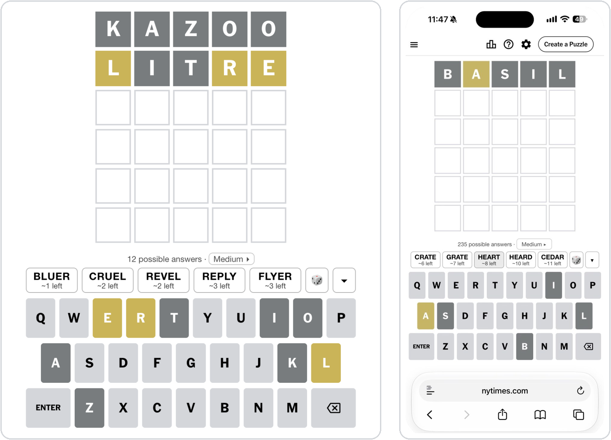
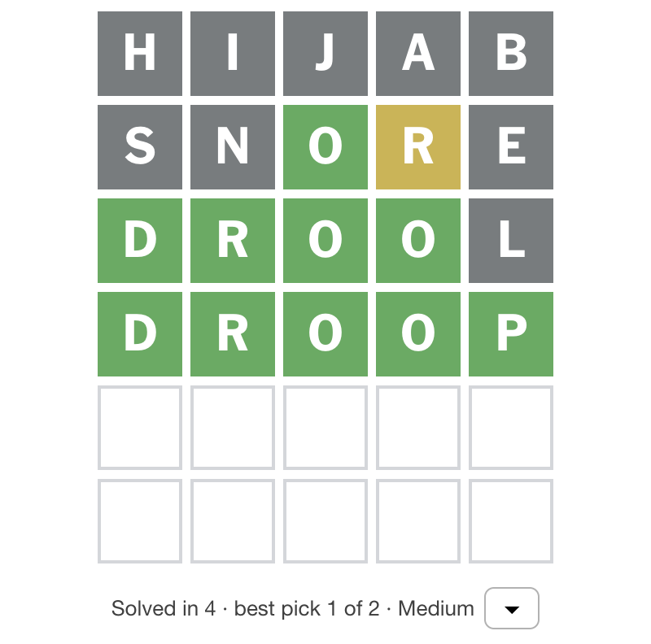
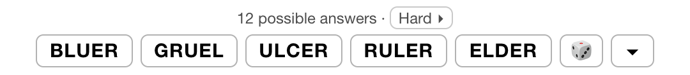

# Wordle Shortlist

For people who want to play the daily Wordle without really playing Wordle.

You get a random starting word (not CRANE, not SLATE, just whatever comes up), then each turn a shortlist of five words that could be the answer. Tap one. That's the job. It's easy, but it isn't autopilot: the five aren't equally good, so there's still a right call to make, and on Hard nobody tells you which one it is.

**Install:** [Greasy Fork](https://greasyfork.org/en/scripts/599505-wordle-shortlist) · [GitHub](https://raw.githubusercontent.com/dividedby/games-scripts/main/wordle/wordle-shortlist.user.js) · [Changelog](../CHANGELOG.md#wordle-shortlist)

<p align="center">
  
</p>

## How it works

1. Install the script (see [Installing](../README.md#installing)) and open Wordle. Above the keyboard you get a starting word: any of the roughly 3,000 likely answers, picked at random. Some days it's a decent opener. Some days it's KAZOO.
2. Tap it to play it, or type your own word if you feel strongly.
3. After each guess you get 5 picks, and every one of them could be the answer: no clever filler words that only narrow things down, so you're always playing by hard mode's rules. Under each word is roughly how many answers would still be possible if it isn't the one (fewer is better). The line above says how many answers still fit.
4. Tap a pick to play it. Anything you'd already typed is cleared first.
5. When one answer is left, it's the only pick. When the puzzle's over, the shortlist turns into a recap: how many guesses it took, how often you played the best pick on offer, and the level.

The picks are drawn at random from the best possible answers, so some are better than others, and you won't get the same five as anyone else. With 5 or fewer answers left, you see all of them.

<details>
<summary>Screenshot: the recap</summary>
<br>

</details>

## Levels

Tap the level in the line above the picks (**Medium ▸**) to switch it, any time. Mid-puzzle, the new level deals a fresh shortlist. Your choice is remembered for the next puzzles, and the recap names the easiest level you used, so dropping to Easy for one turn shows.

| Level | Picks come from | Hints |
| --- | --- | --- |
| Easy | the 10 best possible answers | shown |
| Medium (default) | the 30 best | shown |
| Hard | any possible answer | hidden: you're on your own |

<details>
<summary>Screenshot: Hard</summary>
<br>

</details>

## Buttons

| Button | Does |
| --- | --- |
| 🎲 | Deal a different shortlist for this turn |
| ▾ | Tuck the shortlist away; tap **🎲 Shortlist** to bring it back |

## Good to know

- **No spoilers:** the script never looks up the day's answer. It only knows the colors on your board and a list of likely answers.
- Your shortlist is saved for each puzzle in your browser, so reloading the page doesn't deal a new one. Puzzles you haven't opened in 60 days are cleaned up.
- Works on archive puzzles too (`nytimes.com/games/wordle/YYYY-MM-DD`).
- Works on phones. On a short screen, the board shrinks a little to make room, so the keyboard stays in view.

## Word lists

The likely answers (about 3,000 words) are NYT WordleBot's list, as curated by [WordGamesBot](https://github.com/WordGamesBot/wordgamesbot.github.io). If the answer turns out not to be on it, the picks come from WordleBot's wider list of about 4,600 common words instead.

The lists change a few times a year. Once a month a GitHub Action checks for changes and, if there are any, opens a pull request with the new lists; merging it releases a new version. To update by hand, run `pnpm update-words`.

## Development

The script is a single file, [`wordle-shortlist.user.js`](wordle-shortlist.user.js), with no build step. Behavior tests load it into jsdom against a simulated Wordle board ([`test/`](test/)):

```sh
pnpm install
pnpm test
```

The [Greasy Fork listing](greasyfork-description.md) text lives here too. Report bugs and ideas in the [issues](https://github.com/dividedby/games-scripts/issues).
